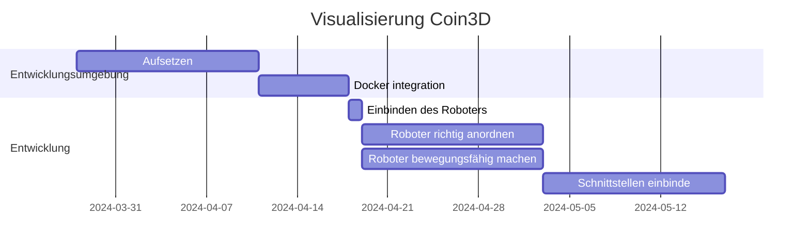

# Visualisierung

Wie das Projekt aufgesetzt, gebaut und ausgeführt wird, steht in der [README im Wurzelverzeichnis](../../README.md#inbetriebnahme).

## Gantt-Diagramm

```mermaid
gantt
    title Visualisierung Coin3D
    dateFormat  YYYY-MM-DD
    
    section Entwicklungsumgebung
    Aufsetzen                       :d1, 2024-03-28, 14d
    Docker integration              :d2, after d1, 7d
    
    section Entwicklung
    Einbinden des Roboters          :d3, after d2, 1d
    Roboter richtig anordnen        :d4, after d3, 14d
    Roboter bewegungsfähig machen   :d5, after d3, 14d
    Schnittstellen einbinde         :d6, after d5, 14d
```